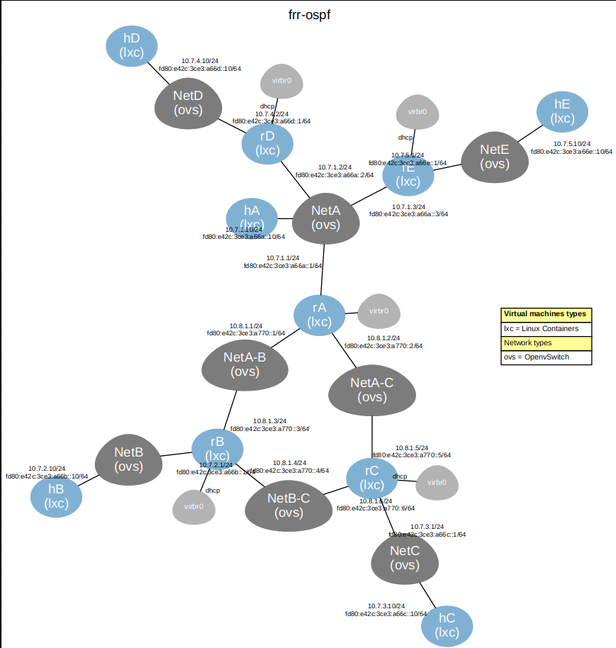

# OSPF_FRR
Virtual Lab using VNX( Virtual Networks over linuX)  to test the security of OSPFv2 and OSPFv3




## Preparación del escenario


Es necesario descargar la imagen del sistema de ficheros utilizada por las instancias del escenario. Desde el directorio `OSPF_FRR/filesystems`, ejecutar:


```bash
sudo vnx_download_rootfs -r vnx_rootfs_lxc_ubuntu64-22.04-v025-fw.tgz
sudo ln -s vnx_rootfs_lxc_ubuntu64-22.04-v025-fw rootfs_lxc
```
### Credenciales Hosts y routers:

Username:root
Password:xxxx

# Escenario de pruebas OSPF-FRR 


OSPF con dos areas, un area 0 (backbone) con 3 routers interconectados con enlaces punto a punto.
Y otra area (area 1) con routers conectados con enlaces punto a multipunto.

Ambos tienen configurados ipv4 e ipv6.

## DOS ESCENARIOS:

Escenario sin seguridad en las areas de OSPF:


```bash
sudo vnx -f frr-ospf-lan.xml -x loadra
sudo vnx -f frr-ospf-lan.xml -x loadrb
sudo vnx -f frr-ospf-lan.xml -x loadrc
sudo vnx -f frr-ospf-lan.xml -x loadrd
sudo vnx -f frr-ospf-lan.xml -x loadre
```
-----------------------------------------------------------------------------------------------------------
Escenario con seguridad (OSPF trailer):

Comando para cargar todas las configuraciones en los routers correspondientes:

```bash
sudo vnx -f frr-ospf-lan.xml -x load_keys
```
O bien se puede ejecutar uno por uno:
```bash
sudo vnx -f frr-ospf-lan.xml -x loadra_key
sudo vnx -f frr-ospf-lan.xml -x loadrb_key
sudo vnx -f frr-ospf-lan.xml -x loadrc_key
sudo vnx -f frr-ospf-lan.xml -x loadrd_key
sudo vnx -f frr-ospf-lan.xml -x loadre_key
```

-----------------------------------------------------------------------------------------------------------
POR DEFECTO CARGA EL ESCENARIO SIN AUTENTICACION EN OSPF.

FRR no permite el uso de IPSEC en OSPF, directamente no es posible configurar el comando en la consola.


-----------------------------------------------------------------------------------------------------------

## Direcciones IPs:
Hosts:
| Host      | Interfaz     | IPv4           | IPv6                                  |
|-----------|--------------|----------------|----------------------------------------|
| rA        | netA         | 10.7.1.1/24    | fd80:e42c:3ce3:a66a::1/64              |
| rA        | netA-B       | 10.8.1.1/24    | fd80:e42c:3ce3:a770::1/64              |
| rA        | netA-C       | 10.8.1.2/24    | fd80:e42c:3ce3:a770::2/64              |
| hA        | -            | 10.7.1.10/24   | fd80:e42c:3ce3:a66a::10/64             |
| rB        | netB         | 10.7.2.1/24    | fd80:e42c:3ce3:a66b::1/64              |
| rB        | netA-B       | 10.8.1.3/24    | fd80:e42c:3ce3:a770::3/64              |
| rB        | netB-C       | 10.8.1.4/24    | fd80:e42c:3ce3:a770::4/64              |
| hB        | -            | 10.7.2.10/24   | fd80:e42c:3ce3:a66b::10/64             |
| rC        | netC         | 10.7.3.1/24    | fd80:e42c:3ce3:a66c::1/64              |
| rC        | netA-C       | 10.8.1.5/24    | fd80:e42c:3ce3:a770::5/64              |
| rC        | netB-C       | 10.8.1.6/24    | fd80:e42c:3ce3:a770::6/64              |
| hC        | -            | 10.7.3.10/24   | fd80:e42c:3ce3:a66c::10/64             |
| rD        | netD         | 10.7.4.1/24    | fd80:e42c:3ce3:a66d::1/64              |
| rD        | netA         | 10.7.1.2/24    | fd80:e42c:3ce3:a66a::2/64              |
| hD        | -            | 10.7.4.10/24   | fd80:e42c:3ce3:a66d::10/64             |
| rE        | netE         | 10.7.5.1/24    | fd80:e42c:3ce3:a66e::1/64              |
| rE        | netA         | 10.7.1.3/24    | fd80:e42c:3ce3:a66a::3/64              |
| hE        | -            | 10.7.5.10/24   | fd80:e42c:3ce3:a66e::10/64             |


## Cambios de claves del OSPF trailer 

El script change.key permite automatizar el cambio de claves en el proceso de OSPF.

Su objetivo principar el modificar la key_id del keychain actual para añadirle un tiempo maximo de uso y crear una nueva key dentro de la misma key_chain para sustituir a la anterior.


La lógica del cambio de claves es la siguiente

### Key en uso (`key_id`)

| Tipo             | Desde       | Hasta       |
|------------------|-------------|-------------|
| accept lifetime  | date-time   | date-time   |
| send lifetime    | date-time   | date-time   |

### Key nueva (`key_id + 1`)

| Tipo             | Desde       | Hasta     |
|------------------|-------------|-----------|
| accept lifetime  | date        | infinite  |
| send lifetime    | date        | infinite  |


## Script de python para automatizar el cambio de claves 

La lógica anterior se implementa en un script de python en el directorio /change_key
Utilice el siguiente comando para ejecutarlo:

```bash
sudo python3 change_key.py --key [Nombre del Key-chain, Key_id en uso, Clave_nueva] --routername [nombres de los routers] --time {segundos}
```
### Argumento key:

Define el nombre de la key_chain en uso, el key_id que se está utilizando y la nueva clave que será utilizada junto con el algoritmo hmac-sha-256 para el trailer de OSPF.

### Argumento routername

Define el conjunto de routers que se verán afectados por este cambio

-all (Modifica todos los routers del escenario ["rA","rB","rC","rD","rE"])

### Argumento time:

Define el numero de segundos que se utilizará de intervalo, el tiempo minimo es 60 segundos, si introducimos un tiempo menor a 60 segundo se utilizará 60 segundos

### Ejemplos:

```bash
sudo python3 change_key.py --key 1 1 EVANGELION --routername all --time 10
sudo python3 change_key.py --key 1 4 EVANGELION3 --routername rA rB --time 100
```

Comandos para comprobar que se ha cambiado las keys:

```bash
show ip ospf interface {interface_name}
show running-config
```